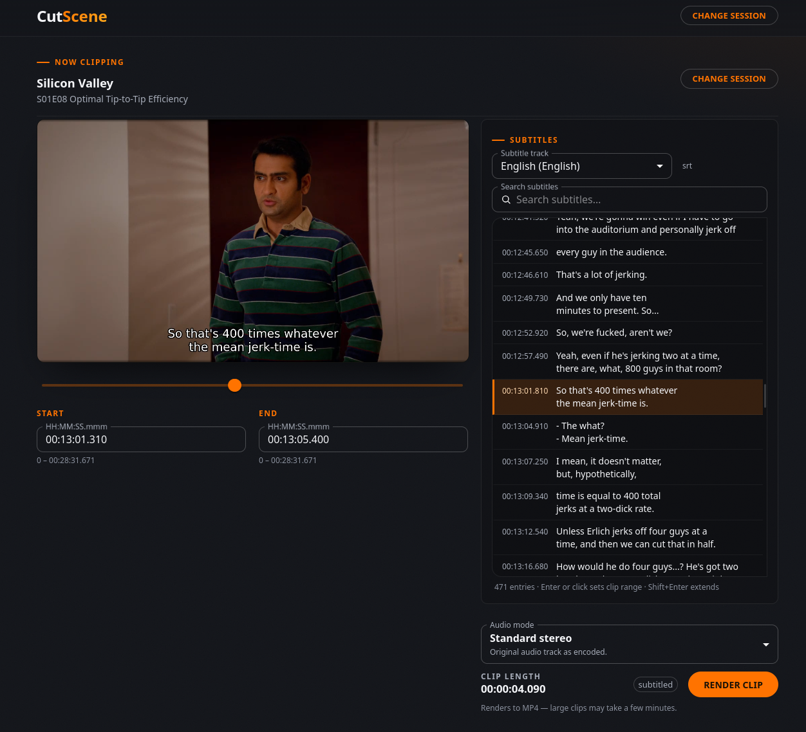

# CutScene

CutScene lets you create short clips from media that is currently playing in Plex. It includes a browser UI and an HTTP API.



## Setup

Copy [config.example.yaml](config.example.yaml) to [config.yaml](config.yaml) in the same directory and set the values for your Plex server. The Plex token is used by CutScene to read server metadata; see [Plex's instructions for finding an authentication token](https://support.plex.tv/articles/204059436-finding-an-authentication-token-x-plex-token/).

Set `api.domain` to the browser-reachable base URL for CutScene. It is passed to Plex as the OAuth/PIN authentication forward URL, so it must be the URL users can return to after signing in (not a private container hostname).

The default [docker-compose.yaml](docker-compose.yaml) uses the [GitHub Container Registry image](https://github.com/ahornerr/CutScene/pkgs/container/cutscene). Start it with:

```sh
docker compose up
```

If you changed the listen address or port, update the port mapping in [docker-compose.yaml](docker-compose.yaml).

### Durable clips and storage

Completed renders are promoted to durable clips. Configure `storage.root` (the
sample uses `/data`) as the local application-data directory. CutScene stores
the SQLite clip metadata database there, MP4s below `clips/`, and the
`clip-token.key` encryption key. The default Compose file mounts the named
`cutscene-data` volume at `/data`; it deliberately does not mount `/tmp`, which
contains transient render jobs and may be cleared on restart.

If `storage.root` is omitted it defaults to `./data` relative to the CutScene
process working directory. If `storage.database` is omitted it defaults to
`clips.sqlite3` directly below that root; configured database paths must remain
relative to the root.

Do not use `docker compose down -v` unless you intend to delete the durable
volume and all saved clips.

The storage root and clip directory are created with owner-only permissions;
the root and clip directory use `0700`, and `clip-token.key` must be exactly
`0600`. Restrict access to that key as you would any capability secret. Keep
the database, MP4s, and key in the same encrypted backup set. Before upgrading
from an older release, take a complete encrypted backup of the storage root;
the key is required to preserve encrypted share links. Backups should be taken
with CutScene stopped (or with a filesystem/database snapshot) so metadata and
files represent one point in time. If the key is missing or wrong, startup
refuses to run until the matching key is restored; it does not generate a
replacement key. The MP4s may remain, but the service will not expose or serve
encrypted share links without that matching key.

To use a host path or a custom volume, set `storage.root` and mount that exact
path into the container. For example, with `storage.root: /srv/cutscene`, use
`/host/cutscene:/srv/cutscene` rather than mounting `/data`; the database path
is relative to the root by default and absolute or escaping paths are rejected.
Startup validates the restored schema, key, encrypted tokens, and clip files.
A missing database, missing/wrong key, or ambiguous restore fails closed and
leaves existing MP4s untouched; restore the matching backup and retry.

Durable clip capacity is intentionally unbounded by application policy. Monitor
the mounted filesystem and plan disk alerts/backups; the existing queue,
per-owner, FFmpeg, and transient render limits still apply.

On startup, CutScene preflights clip metadata and files before any migration
or reconciliation. Mismatched, stale, partial, or unreferenced durable state
fails closed without deleting either side. A legacy Phase 1 hash-only database
is migrated to encrypted token storage; because the old
raw token was not retained, those legacy clips receive newly generated share
tokens while their metadata and MP4s are preserved. Deleting a clip is a hard
delete of both its SQLite metadata and MP4 bytes and is permanent.

### Authentication

Open the CutScene URL in a browser and choose **Log in with Plex**. CutScene uses Plex's browser authentication flow and keeps the authenticated session in the browser. The session, preview, and render endpoints require that authenticated session; an HTTP client must preserve the session cookie established by its Plex login.

### Hardware acceleration

The default `libx264` codec uses software encoding. On Linux, set `ffmpeg.codec` to `h264_vaapi` for VAAPI hardware encoding. The host and container need access to a usable render device under `/dev/dri`; the supplied [docker-compose.gpu.yaml](docker-compose.gpu.yaml) mounts `/dev/dri/renderD128`:

```sh
docker compose -f docker-compose.yaml -f docker-compose.gpu.yaml up
```

The VAAPI setup is tested with AMD GPUs on Linux. Intel QuickSync through VAAPI may work but is untested. `h264_nvenc` is also available for Nvidia, but requires a working Nvidia driver, the [Nvidia Container Toolkit](https://github.com/NVIDIA/nvidia-container-toolkit), and Docker configured to expose the GPU; the supplied GPU override only provides the VAAPI/DRI device.

## Usage

### Browser

After authentication, choose an active Plex session in the UI, preview and trim it, then submit the render. Completed clips are downloadable from the render-job status panel.

### HTTP render jobs

The examples below assume an authenticated session cookie in `$COOKIE`:

```sh
BASE=http://127.0.0.1:8080
curl -sS -b "$COOKIE" "$BASE/sessions"
```

Use an active session's `ratingKey` and media/part ID as `mediaId` to create a job. The request must be JSON:

```sh
curl -i -b "$COOKIE" \
  -H 'Content-Type: application/json' \
  -d '{
    "ratingKey": "100151",
    "mediaId": 123456,
    "fromMs": 300000,
    "toMs": 305000,
    "subtitleIndex": -1,
    "height": 720,
    "qp": 24,
    "audioMode": "standard"
  }' \
  "$BASE/render-jobs"
```

Creation returns `202 Accepted`, a JSON job object, and a `Location` header such as `/render-jobs/<id>`. Poll that URL until `status` is `succeeded` or `failed` (or the job expires):

```sh
curl -sS -b "$COOKIE" "$BASE/render-jobs/<id>"
curl -fL -b "$COOKIE" "$BASE/render-jobs/<id>/download" -o clip.mp4
```

Jobs are private to the authenticated user. A successful output is temporary and normally expires within one hour; use `expiresAt` and download it before expiry. An expired job or download returns `410 Gone`.

If render capacity or temporary service/storage capacity is unavailable, creation can return `429` or `503` with a `Retry-After` header. Wait for that interval before retrying rather than submitting a tight loop.

#### Render options

- `subtitleIndex`: `-1` for no subtitles, or the selected subtitle index.
- `height`: output height in pixels; `0` keeps the source height. Valid explicit heights are 144–2160 and even.
- `qp`: encoder quantization parameter, `0` for the encoder default, or a value from 0–51.
- `audioMode`: `standard` (original audio), `dialogue` (centred-dialogue boost), or `dialogue_normalized` (dialogue boost plus loudness normalization). If omitted, it defaults to `standard`.

The selected range must be ordered, non-negative, and no longer than 15 minutes.

`ffmpeg.concurrency` controls the maximum number of concurrent FFmpeg processes. It defaults to `2` when omitted or non-positive, and the limit is shared by previews, subtitle preparation, and render jobs.

## Development

The [docker-compose.build.yaml](docker-compose.build.yaml) file builds the Docker image from source:

```sh
docker compose -f docker-compose.yaml -f docker-compose.build.yaml up --build
```

Alternatively, compile or run directly with `go build ./...` or `go run ./...` (Go >= 1.22 recommended).

